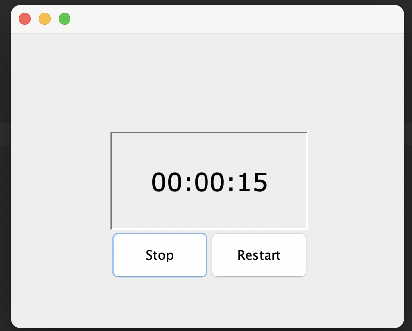

# stopwatchGUI

## Project Description
This project's goal was to create a stopwatch GUI. The stopwatch would keep track of seconds, minutes, and hours passed. You can start, stop, and reset by clicking the labeled buttons. 

## Languages
Java

## How to Run
Open in your IDE. Create a new object. Run.

## How to Use
This would be used by a large project that needed a timer aspect to it, such as a video game.

## Future Plans
I would like to create a game where this stopwatch is a part of the time-tracking aspect.

## Credits
Bro Code, YouTube

